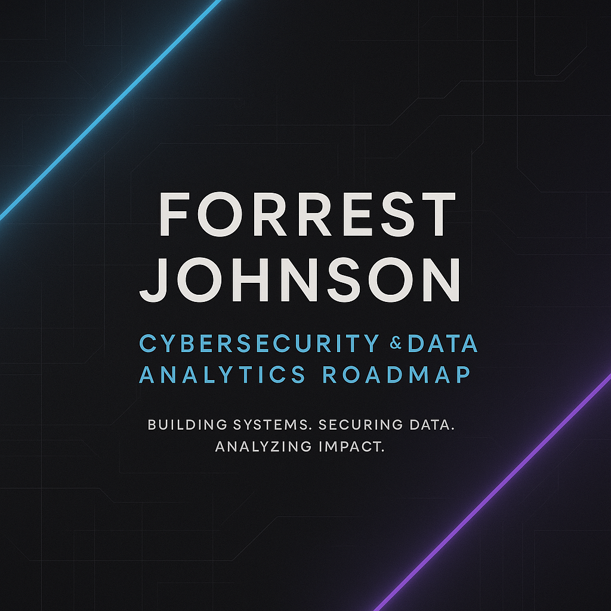

# Forrest Johnson — Cybersecurity & Analytics Roadmap

Welcome! 👋  
This repository documents my journey from a physical labor career into the world of technology.  
I’m building practical, real-world skills in **Cybersecurity** and **Business Analytics** with the goal of working remotely in a technical analyst role.

---

## 🎯 Mission
Develop the technical, analytical, and professional toolkit needed to move into a long-term tech career.  
This includes:
- Completing the **Google Cybersecurity Professional Certificate**
- Building hands-on security labs and automation projects
- Mastering spreadsheets, SQL, and Python for data analysis
- Creating dashboards and financial tracking tools
- Developing a personal portfolio of cybersecurity and analytics work

---

## 🔐 Cybersecurity Path
**Main Track**
- Google Cybersecurity Professional Certificate (in progress)
- CompTIA Security+ certification (planned)
- Linux, SQL, and Python for security tasks
- Labs covering risk management, vulnerability scanning, and incident response
- Capstone project: end-to-end security report with automated log analysis

📂 Folder: Phase1/ → course notes and labs  
📂 Folder: Phase2/Phase3/ → Security+ prep and advanced labs  

---

## 📊 Analytics & Operations Path
**Parallel Track**
- Excel / Google Sheets: advanced formulas, pivot tables, and dashboards  
- SQL: querying business and financial data  
- Python (pandas): data cleaning and report automation  
- Power BI / Looker Studio: visual dashboards for ROI & performance metrics  

📂 Folder: Analytics/ → dashboards, automations, and daily logs  

**Example Projects**
- Budget & Expense Tracker  
- Lead Cost & ROI Dashboard  
- Automated Monthly Financial Report (Python)  

---

## 🗂 Repository Structure
CyberRoadmap/  
│  
├── Phase1/ — Cybersecurity certificate notes & labs  
├── Analytics/ — Business analytics projects & notes  
│  └── Notes/ — Daily learning logs  
├── Notes/ — General progress notes  
└── README.md — This roadmap overview  

---

## 📅 Current Focus
- Completing Module 1–2 of the Google Cybersecurity Certificate  
- Building the first analytics project: Budget & Expense Tracker in Google Sheets  
- Logging daily progress in the Notes/ folders  

---

## 🧭 Looking Ahead
- Finish all 8 courses of the Cybersecurity Certificate  
- Earn the CompTIA Security+ credential  
- Complete 3 analytics dashboards and 1 automation project  
- Publish portfolio projects and launch LinkedIn profile  

---

## 📫 Contact
- 📧 Email: *coming soon *  
- 🌐 LinkedIn: *coming soon*  
- 🗂 GitHub Portfolio: [github.com/ftj1994](https://github.com/ftj1994)
